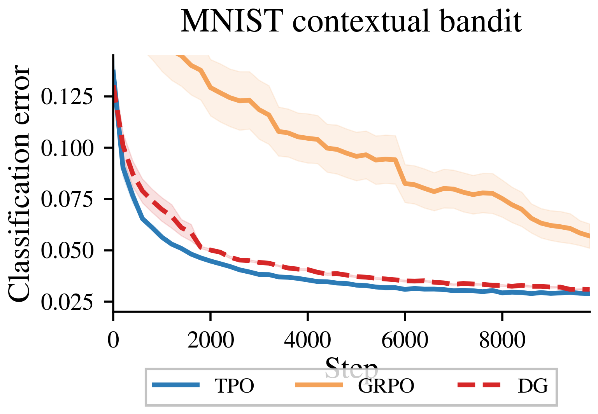
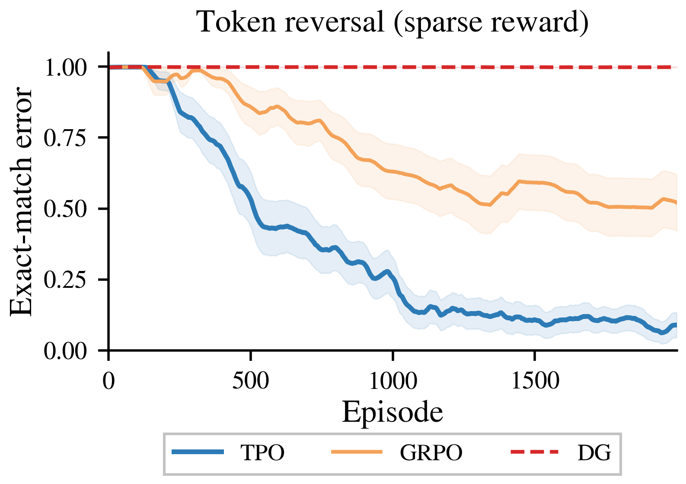

# Target Policy Optimization

**[Paper Link](https://arxiv.org/abs/2604.06159)**

<p align="center">
  
  
</p>
<p align="center">
  <em>Left: MNIST contextual bandit (20 seeds). Right: sparse-reward token reversal at H=10 (20 seeds). TPO matches baselines on easy tasks and outperforms them under sparse reward.</em>
</p>

This repo contains JAX code for the TPO paper's experiments across tabular bandits, MNIST contextual bandits, and transformer sequence tasks.

## What is TPO?

Standard RL methods (GRPO, DG, PPO) entangle *which completions should gain probability mass* with *how parameters move to realize that change*. TPO decouples the two. Given scored candidates, it constructs a closed-form target distribution `q_i ∝ p_i^old · exp(u_i)` and fits the policy to it by cross-entropy minimization. The loss gradient is `p - q`, which vanishes exactly when the policy matches the target. No policy gradients, no clipping, no critic.


## Quick Start

```bash
cd tpo
uv sync

# Optional: Linux + NVIDIA GPU install
# uv sync --extra cuda12

# Fast smoke test (~1 min)
uv run python -m tpo.cli all --smoke --no-wandb --save-dir /tmp/tpo-smoke

# Run a full experiment (e.g. MNIST contextual bandit)
uv run python -m tpo.cli mnist
```

`uv sync` installs the CPU-safe default stack, including macOS. Only use `uv sync --extra cuda12` on Linux machines with an NVIDIA GPU and CUDA 12 support.

## Key Experiments

| Experiment | Command | Description |
|:---|:---|:---|
| Tabular (single) | `tpo.cli tabular_single` | Single-context bandit |
| Tabular (multi) | `tpo.cli tabular_multi` | Multi-context bandit |
| MNIST | `tpo.cli mnist` | Contextual bandit |
| Token reversal (dense) | `tpo.cli transformer` | Dense-reward sequence task |
| Token reversal (sparse) | `tpo.cli transformer_rlvr` | Sparse-reward sequence task |

All commands are run via `uv run python -m tpo.cli <experiment>`. Use `--help` for advanced options including vocab sweeps, ablations, and custom overrides. Figures are saved to `figures/` by default.

## Project Structure

```
tpo/
├── src/tpo/
│   ├── algorithms.py      # TPO, GRPO, DG, REINFORCE loss functions
│   ├── models.py          # PolicyMLP, CausalTransformer (Flax)
│   ├── config.py          # Experiment configs (frozen dataclasses)
│   ├── cli.py             # Entry point
│   └── experiments/       # One runner per experiment
├── scripts/               # Standalone plot scripts for hero figures
└── tests/
```

## Citation

```bibtex
@misc{kaddour2026targetpolicyoptimization,
      title={Target Policy Optimization},
      author={Jean Kaddour},
      year={2026},
      eprint={2604.06159},
      archivePrefix={arXiv},
      primaryClass={cs.LG},
      url={https://arxiv.org/abs/2604.06159},
}
```
